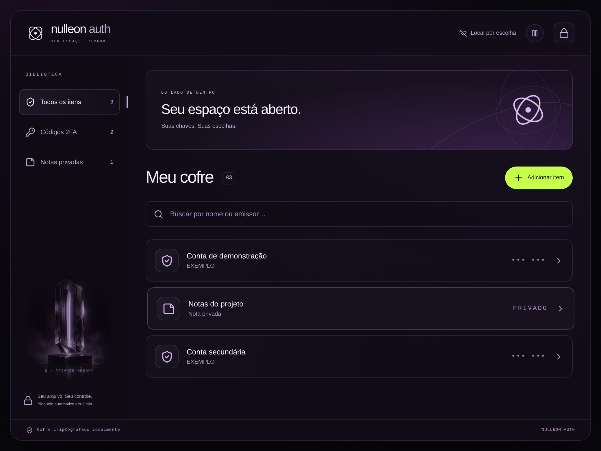
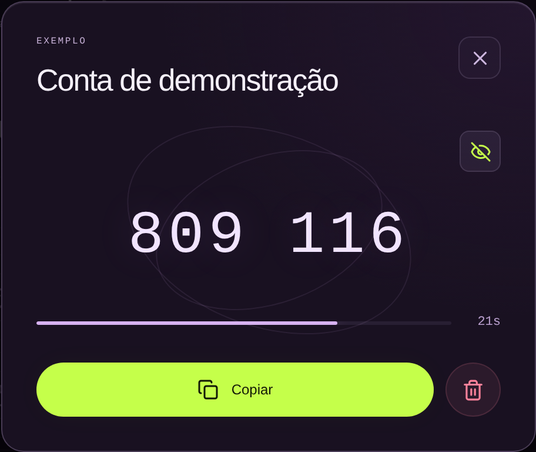
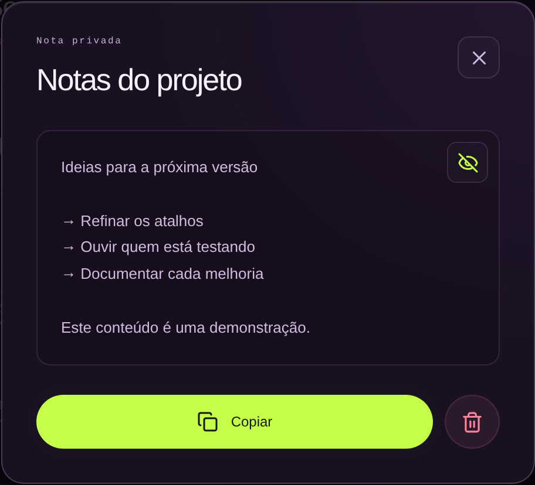
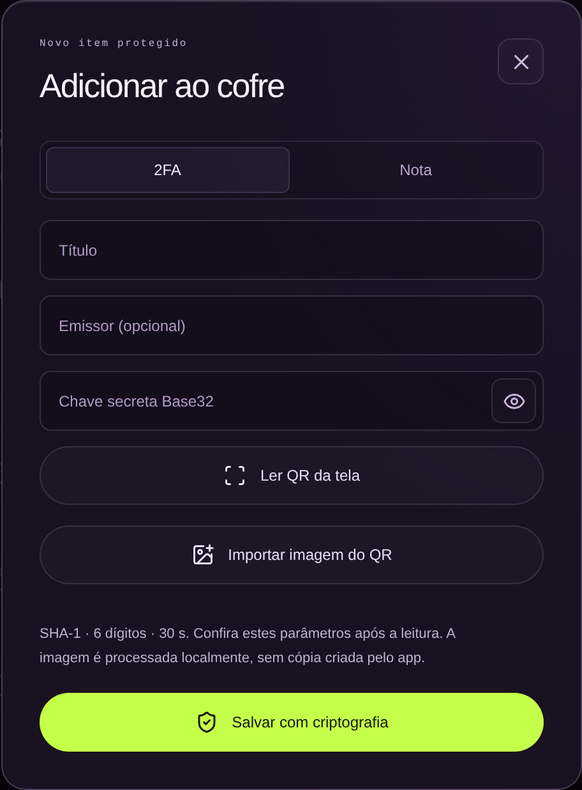

# Nulleon Auth

<p align="center">
  
</p>

<p align="center"><strong>Seu cofre local para códigos TOTP e notas privadas.</strong><br>Desktop para Linux e Windows, com dados sob seu controle.</p>

<p align="center">
  <a href="https://nulleonauth.tech/">Site</a> ·
  <a href="https://github.com/nulleondev/nulleon-auth-desktop/releases">Downloads</a> ·
  <a href="https://www.instagram.com/dev.nulleon/">Instagram</a>
</p>



As imagens desta página usam dados sintéticos e servem para apresentar a interface. O aplicativo mantém o arquivo do cofre no dispositivo; o site não recebe uma cópia.

## O que você encontra

- Códigos TOTP com suporte a SHA-1, SHA-256 e SHA-512, 6 ou 8 dígitos e período configurável.
- Notas privadas no mesmo cofre local criptografado.
- Bloqueio automático após três minutos de inatividade e recolhimento do conteúdo ao trocar de janela.
- Leitura de QR pela tela ou por imagens PNG, JPEG e WebP.
- Interface pensada para uso offline, sem conta obrigatória e sem sincronização oculta.

## Interface

<p align="center">
  
  
</p>

<p align="center">
  
  
</p>

## Downloads

Os instaladores ficam em [Releases](https://github.com/nulleondev/nulleon-auth-desktop/releases). A edição 0.2.8 é um pré-lançamento sem certificado de desenvolvedor: o Windows pode exibir o SmartScreen. O macOS está em breve, aguardando certificado e notarização.

- Linux x86_64 (Ubuntu 24.04 ou equivalente mais recente): AppImage. Dê permissão de execução e abra o arquivo. Em sistemas sem FUSE, use `--appimage-extract-and-run`.
- Windows x64: instalador NSIS. Usa Microsoft Edge WebView2.
- macOS: em breve. Nenhum download público habilitado nesta versão.

Confira os arquivos SHA256SUMS antes de instalar. Builds automatizadas e teste de abertura não substituem validação em todos os modelos de computador.

## Primeiro acesso

Crie uma senha mestra de pelo menos 12 caracteres e guarde as 12 palavras de recuperação. Você também pode importar um arquivo `.nauth` existente com sua senha. A importação não substitui um cofre já instalado.

O arquivo é protegido com AES-256-GCM; a senha usa Argon2id com 128 MiB, três iterações e paralelismo 1. A versão 2 permanece compatível com os cofres existentes. Guarde também uma cópia do arquivo: as palavras sozinhas não recuperam dados de um arquivo perdido.

Pasta padrão:

- Linux: `$XDG_DATA_HOME/com.nulleon.authenticator/` ou `~/.local/share/com.nulleon.authenticator/`.
- Windows: `%LOCALAPPDATA%\com.nulleon.authenticator\`.
- macOS: `~/Library/Application Support/com.nulleon.authenticator/`.

Arquivos legados continuam sendo reconhecidos. O aplicativo bloqueia após três minutos de inatividade e tenta limpar o texto que copiou após 30 segundos, sem apagar um texto que outro aplicativo colocou no clipboard.

## QR

Leia códigos na tela ou importe PNG, JPEG e WebP. TOTP suporta SHA-1, SHA-256 e SHA-512, com 6 ou 8 dígitos e período configurável. Revise os dados antes de salvar. HOTP e exportação em lote `otpauth-migration` não são suportados. No Linux Wayland, use importação de imagem ou chave manual; captura de tela permanece desativada. O macOS exige permissão de gravação de tela para captura.

## Desenvolvimento

Requisitos: Node.js 22, Rust stable e as [dependências Tauri](https://tauri.app/start/prerequisites/) do seu sistema. A compilação Linux usa Ubuntu 24.04 ou equivalente, com os pacotes de desenvolvimento PipeWire, D-Bus e Clang.

```sh
npm ci --ignore-scripts
npm test
npm run dev -w nulleon-auth-landing
npm run tauri -w nulleon-authenticator -- dev
```

```sh
cargo test --manifest-path apps/nulleon-authenticator/src-tauri/Cargo.toml --lib -- --test-threads=1
npm run tauri -w nulleon-authenticator -- build
python3 scripts/check-private-files.py --history
```

Este repositório publica apenas o desktop e a landing page. Não contém API administrativa, dashboard de demonstração, cofres ou dados pessoais. Leia [SECURITY.md](SECURITY.md) e preserve os avisos de dependências em [THIRD_PARTY_NOTICES.md](THIRD_PARTY_NOTICES.md).

Criado por [@dev.nulleon](https://www.instagram.com/dev.nulleon/).
